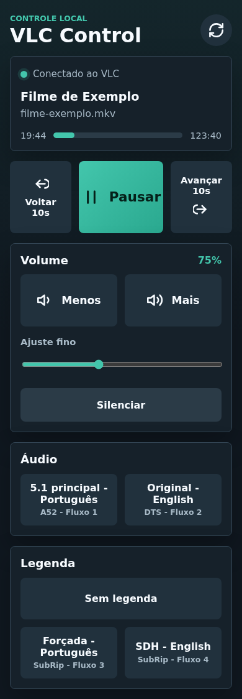

# VLC Web Remote

Interface web responsiva para controlar o VLC pela rede local. O app roda em Node.js, serve uma tela mobile-first e faz proxy local para a interface HTTP do VLC.



## Recursos

- Pausar e reproduzir o video atual.
- Avancar e voltar 10 segundos.
- Aumentar, diminuir, silenciar e ajustar volume ate 200%.
- Selecionar faixas de audio e legendas.
- Acessar pelo celular usando o endereco da rede local.
- Abrir videos pelo menu grafico com o VLC ja iniciado com HTTP ativo.

## Requisitos

- Node.js 18 ou superior.
- VLC instalado no computador que vai tocar o video.
- iPhone/celular e computador na mesma rede Wi-Fi.

## Como Rodar

Crie a configuracao local:

```bash
cp .env.example .env
```

Edite `.env` se quiser trocar a senha padrao `vlc`. Use a mesma senha no VLC em `Ferramentas > Preferencias > Tudo > Interface > Interfaces principais > Lua > Lua HTTP`.

Inicie o VLC com HTTP ativo:

```bash
./scripts/start-vlc.sh
```

Em outro terminal, inicie o controle web:

```bash
npm start
```

Abra no celular o endereco mostrado como `Rede local`, por exemplo:

```text
http://192.168.0.10:3000
```

## Desenvolvimento

```bash
npm run dev
npm test
```

`npm run dev` usa `node --watch src/server.js` para reiniciar o servidor ao alterar arquivos do backend. `npm test` roda os testes com `node:test`. O frontend fica em `public/` e nao precisa de build.

## Configuracao

| Variavel | Padrao | Uso |
| --- | --- | --- |
| `PORT` | `3000` | Porta da interface web |
| `HOST` | `0.0.0.0` | Endereco de escuta do servidor |
| `VLC_PROTOCOL` | `http` | Protocolo do VLC |
| `VLC_HOST` | `127.0.0.1` | Host onde o VLC esta rodando |
| `VLC_PORT` | `8080` | Porta HTTP do VLC |
| `VLC_PASSWORD` | `vlc` | Senha Lua HTTP configurada no VLC |
| `VLC_VOLUME_STEP` | `32` | Passo dos botoes de volume |
| `VLC_FORCE_SOFTWARE_GL` | `0` | Use `1` se o VLC falhar com erro de OpenGL/Mesa |

Tambem e possivel sobrescrever valores ao iniciar:

```bash
VLC_HOST=192.168.0.20 VLC_PASSWORD=sua_senha npm start
```

## Abrir Videos pelo Menu Grafico

Para instalar a entrada `Abrir com VLC` usando o script do projeto:

```bash
./scripts/install-open-with-vlc.sh
```

Depois disso, videos abertos pelo gerenciador de arquivos iniciam o VLC com a interface HTTP ativa.

## Estrutura

```text
src/                 Servidor Node.js e cliente da API do VLC
public/              HTML, CSS e JavaScript da interface
scripts/             Automacoes para iniciar e integrar o VLC
docs/                Guias e imagens do projeto
docs/vlc-setup.md    Passo a passo detalhado de configuracao do VLC
```

## Seguranca

Nao publique `.env` nem senhas reais. O projeto ja ignora `.env`, `node_modules/`, logs e arquivos temporarios de automacao. Se for expor fora da rede local, coloque autenticacao e HTTPS na frente do servidor.

## Solucao de Problemas

- Confira se VLC e celular estao na mesma rede.
- Confirme se o VLC esta aberto com a interface Web habilitada.
- Verifique se `VLC_PASSWORD` e igual a senha Lua HTTP do VLC.
- Consulte [docs/vlc-setup.md](docs/vlc-setup.md) para setup detalhado.
